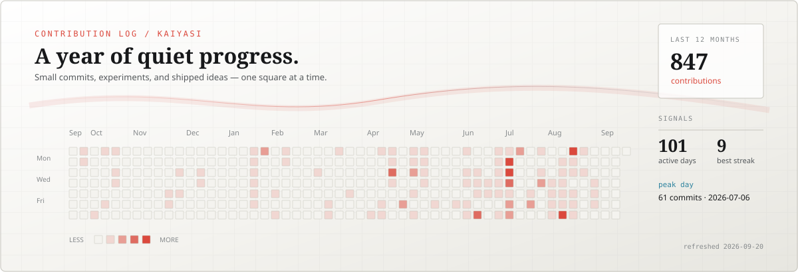

  

<h1 align="center">Hi, I'm Kaiyasi.</h1>

  <strong>Student developer · builder of web tools · learning in public</strong> 
  Python · Go · Astro · React

  <a href="https://gonets.top/">Website</a>
  ·
  <a href="http://blog.gonets.top">Blog</a>
  ·
  <a href="mailto:zengcode0315@gmail.com">Email</a>
  ·
  <a href="https://instagram.com/kaiyasi.0315">Instagram</a>
  ·
  <a href="https://discordapp.com/users/759651999036997672">Discord</a>

  

## About

I’m a student developer from Taipei and a recent graduate of [Municipal Neihu Senior High School](https://www.nhsh.tp.edu.tw/). I’ll be starting my first year at [National Chung Hsing University](https://www.nchu.edu.tw/) as a special-selection student in the Data and Scientific Computing Group of the Department of Applied Mathematics.

I’m currently developing Throven, a self-hosted service platform that brings Git collaboration, application delivery, and infrastructure operations into one place. Hopefully, I’ll survive the “Feast of Mathematics” at university.

## Featured projects

| Project | What it is | Stack |
| --- | --- | --- |
| [Ari-IME](https://github.com/kaiyasi/Ari-IME) | A Fcitx5 input method that lets Traditional Chinese and English flow together without mode switching. | C++ · Fcitx5 · libchewing |
| [FourmKit](https://github.com/kaiyasi/FourmKit) | A semi-anonymous community platform with real-time interaction. | TypeScript · React · Flask · Docker |
| [SITCON Camp 2026 — 官網](https://sitcon.camp/2026/) | The official camp website for the 2026 program, schedule, registration, and event information. | Astro · TypeScript |
| [SITCON Camp 2026 — 大地遊戲](https://github.com/sitcon-tw/camp2026-game) | A knowledge-exploration game that turns camp missions and discovery into a shared game loop. | Go · React · MongoDB |

## Toolbox

`Python` `C++` `Vue.js` `Go` `React` `TypeScript` `Docker` `Git` `Linux`

## Contribution log

  

  Updated automatically every day from GitHub's public contributions calendar.

  <em>「惨めなら抵抗し、悔しいなら前に進もう。」</em>

